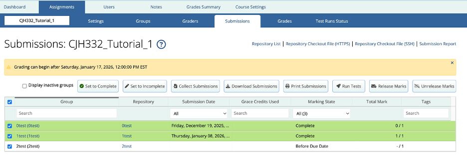
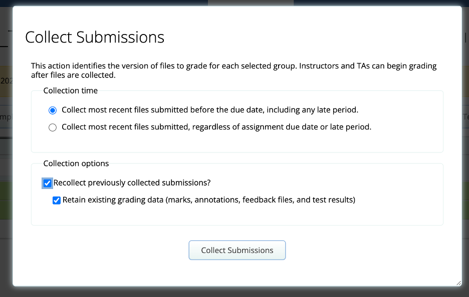
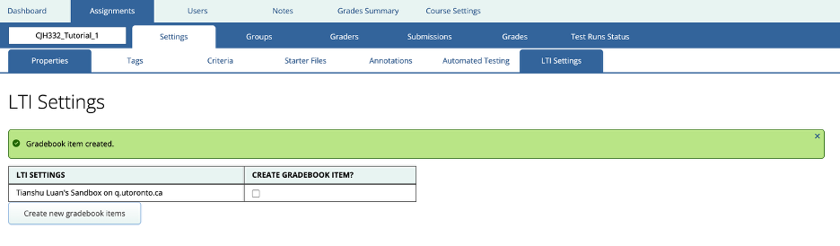
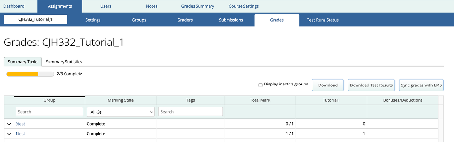

# MarkUs Instructor Guide
## Grading

### Collecting Submissions
1. Navigate to the `Assignment` tab
2. Select the desired assignment
3. Click on `Submissions` tab
4. Click on the checkbox next to Group in the table to select all students

5. Click on `Collect Submissions`
6. Select `Recollect previously collected submissions?` then click `Collect Submissions`

### Autotesting Submissions

1. Select all students
2. Click on `Run Tests` button
3. Wait for the tests to complete

### Create Gradebook Item to Quercus

1. Navigate to `LTI Settings`
2. Select `CREATE GRADEBOOK ITEM?`
3. Click on `Create new gradebook items`
4. Wait for the job to be done

### Sync grades to Quercus

1. Navigate to `Grades` tab
2. Make sure all assignment (and every part) are given a grade
3. Click on `Sync grades with LMS`
4. Wait for job to be done

**Note**: It is recommended to do these steps after due date as students can submit revisions of their assignments.
